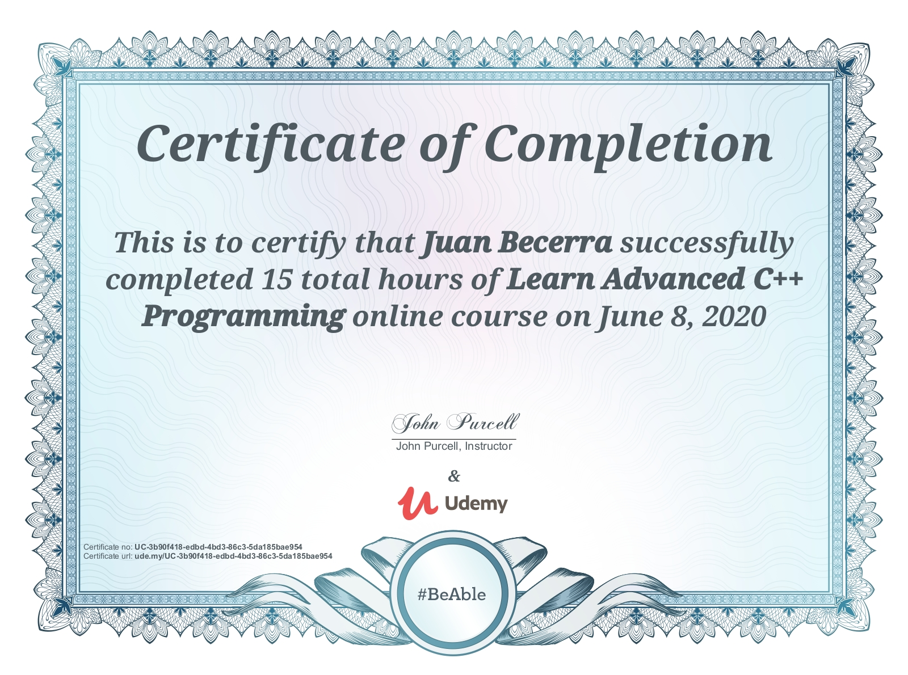

# advancedCPP
All of my work from a Udemy course entitled "Learn Advanced C++ Programming"

Up to now, I've only really delved into C++ for quick and easy personal projects. I want to learn some more advanced topics and eventually build a good modern C++ project for my portfolio, so this repo is keeping track of the work that I’ve completed for this course.

The course that I'm following can be purchased here: https://www.udemy.com/course/learn-advanced-c-programming/

The final project, "Drawing Fractal Images", can be found in this repository: https://github.com/juanbecerra0/FractalImageGenerator

# Certificate

# Log
- 6/08/2020: Completed Section 11: Bonus Videos
- 6/08/2020: Completed Section 10: A Project: Drawing Fractal Images
- 6/06/2020: Completed Section 9: About GUI Programming in C++
- 6/06/2020: Completed Section 8: C++11's Amazing New Features
- 6/02/2020: Completed Section 7: Passing Functions to Functions
- 6/01/2020: Completed Section 6: Template Classes and Functions
- 6/01/2020: Completed Section 5: Operator Overloading
- 5/29/2020: Completed Section 4: The Standard Template Library
- 5/27/2020: Completed Section 3: Files 
- 5/26/2020: Completed Section 2: Exceptions
- 5/26/2020: Completed Section 1: Introduction
